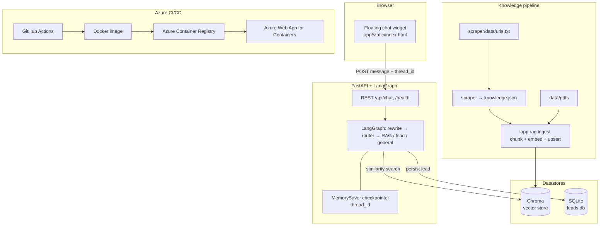

# White-Label AI Concierge (FastAPI + LangGraph + Chroma)

Production-ready, domain-agnostic AI assistant stack:

- **Backend:** FastAPI + LangGraph
- **Knowledge:** Web scraping JSON + PDF ingestion -> embeddings -> Chroma vector DB
- **Lead capture:** Dynamic slot filling -> SQLite
- **Frontend:** Floating website chat widget
- **Infra:** Docker, docker-compose, Azure Web App for Containers, GitHub Actions CI/CD

Main goal: clone this repo, update `config/domain_config.yaml`, add URLs/PDFs, deploy.

## Portfolio Highlights (1-minute read)

- **What it is:** A white-label, production-style AI concierge: chat UI, multi-agent LangGraph orchestration, RAG over your own web + PDF knowledge, and lead capture to SQLite.
- **Why it matters:** Domain changes are mostly YAML + content (URLs/PDFs), not a rewrite of the graph—good for agencies, SaaS demos, and vertical pilots.
- **Stack:** Python 3.11, FastAPI, LangGraph + LangChain, Chroma, SQLite, Docker, Azure Web App for Containers, GitHub Actions.
- **Differentiators:** Same-domain web crawl → JSON → shared vector store with PDFs; `thread_id` + checkpointer for stateless HTTP; optional SSE streaming; CI/CD to Azure.

## System Components

- **Frontend (`app/static/index.html`)**
  - Foldable floating chat widget
  - Calls `POST /api/chat`
  - Persists `thread_id` in browser localStorage
  - Shows retrieval status text while waiting

- **Backend API (`app/main.py`, `app/api/routes.py`)**
  - Stateless REST endpoints
  - Passes `thread_id` into LangGraph checkpointer
  - Supports normal and streaming chat
  - Optional **LangSmith** tracing (API span + graph runs + LLM/retriever children)

- **Agent graph (`app/graph/workflow.py`)**
  - Query rewriter
  - Semantic router (`faq`, `lead_capture`, `general`)
  - RAG over Chroma
  - Lead capture + SQLite commit
  - MemorySaver for multi-turn conversation state

- **Knowledge ingestion (`app/rag/ingest.py`)**
  - Ingests both:
    - PDFs from `data/pdfs/`
    - scraped web JSON from `scraper/data/knowledge.json`
  - Chunk -> embed -> upsert into Chroma collection

- **Web crawler (`scraper/scraper_script.py`)**
  - Reads seed URLs from `scraper/data/urls.txt`
  - Crawls same-domain subpages (`/about`, `/contact`, etc.)
  - Writes normalized JSON knowledge file

- **Databases**
  - **Chroma** for vector retrieval
  - **SQLite** for leads (`db/leads.db`)

- **Infra**
  - `Dockerfile` (production-oriented)
  - `docker-compose.yml` (local app + chroma)
  - `.github/workflows/deploy.yml` (build + deploy container to Azure)

## Architecture

End-to-end data and request flow (GitHub renders Mermaid on the repo home page).



## Project Structure

```text
app/
  api/routes.py
  core/config.py
  core/settings.py
  core/tracing.py
  db/lead_store.py
  graph/workflow.py
  rag/ingest.py
  schemas/chat.py
  static/index.html
config/
  domain_config.yaml
scraper/
  scraper_script.py
  data/urls.txt
  data/knowledge.json      # generated
data/pdfs/
db/
docker-compose.yml
Dockerfile
```

## 5-Minute Implementation Flow

1. **Set environment**
   - Create/update `.env`:

   ```env
   OPENAI_API_KEY=your_key_here
   OPENAI_CHAT_MODEL=gpt-4o-mini
   OPENAI_EMBEDDING_MODEL=text-embedding-3-small
   CHROMA_HOST=localhost
   CHROMA_PORT=8001
   APP_ENV=development
   LANGCHAIN_API_KEY=your_langsmith_key
   LANGCHAIN_PROJECT=white-label-concierge
   ```

2. **Configure your domain**
   - Edit `config/domain_config.yaml`:
     - persona/system prompt
     - routing intents
     - lead slot fields
     - RAG paths/language

3. **Add company knowledge**
   - URLs -> `scraper/data/urls.txt`
   - PDFs -> `data/pdfs/`

4. **Run crawler**
   - `python scraper/scraper_script.py`

5. **Start app + chroma**
   - `docker compose up --build`

6. **Ingest knowledge**
   - `python -m app.rag.ingest`

7. **Test chat**
   - Open `http://localhost:8000`
   - Ask questions based on your URLs and PDFs

## Running Modes

- **Full Docker (recommended local):**
  - App in docker + Chroma in docker
  - `.env`: `CHROMA_HOST=chroma`, `CHROMA_PORT=8000`

- **App local, Chroma docker:**
  - `.env`: `CHROMA_HOST=localhost`, `CHROMA_PORT=8001`

- **Both local (no docker):**
  - `.env`: `CHROMA_HOST=localhost`, `CHROMA_PORT=8000`

The code tries multiple endpoints and falls back to local persistent Chroma if needed.

## Observability (LangSmith)

### Enable tracing

Add to `.env` (get the key from [LangSmith](https://smith.langchain.com/)):

```env
LANGCHAIN_API_KEY=your_key
LANGCHAIN_PROJECT=white-label-concierge
```

When `LANGCHAIN_API_KEY` is set, `app/core/tracing.py` turns on `LANGCHAIN_TRACING_V2` at process startup so LangChain/LangGraph runs send traces to LangSmith.

Optional: `LANGCHAIN_ENDPOINT` if you use a self-hosted LangSmith deployment.

### What gets traced (high value)

| Layer | What you see in LangSmith |
|-------|---------------------------|
| **HTTP** | `api_post_chat`, `api_post_chat_stream` — one trace per request; metadata includes `thread_id` and endpoint. |
| **Graph** | `graph_node_query_rewriter`, `graph_node_semantic_router`, `graph_node_faq_rag`, `graph_node_lead_capture`, `graph_node_general`, `graph_route_intent`. |
| **Retrieval** | `chroma_similarity_search` — explicit retriever span around Chroma `similarity_search`. |
| **LLM** | Chat/completions inside nodes (via LangChain `ChatOpenAI`) appear as child LLM runs when tracing is on. |
| **Ingestion CLI** | `ingest_knowledge_pipeline`, `ingest_load_pdf_documents`, `ingest_load_web_documents` — run `python -m app.rag.ingest` after setting the same env vars. |

### Why `app/core/tracing.py` (and not scattered `os.environ` everywhere)

**Architect rule:** tracing is **cross-cutting infrastructure**, not business logic.

- **Put it in `app/core/tracing.py`** so there is a single place that documents and applies the LangSmith env contract. Entrypoints call `configure_langsmith()` **before** importing modules that build the compiled graph (`graph = build_workflow()` in `app/api/routes.py`). That avoids fragile ordering bugs across Uvicorn workers and CLI tools.
- **Do not push tracing setup into `workflow.py` nodes** — nodes should stay pure (inputs → outputs). Global side effects there make unit tests and reuse harder.
- **Do not only rely on ad-hoc prints** — LangSmith gives structured latency, token usage, and parent/child run trees for debugging production behavior.
- **`@traceable` on graph nodes and the retriever** adds **named spans** for steps LangChain might not label the way you want (especially custom Chroma calls and multi-node graphs).

## Knowledge Pipeline (Web + PDF)

### Web crawl

- Input: `scraper/data/urls.txt`
- Output: `scraper/data/knowledge.json`
- Behavior:
  - same-domain crawl
  - BFS strategy
  - depth/page limits in `scraper/scraper_script.py`

### Ingestion commands

- Ingest all:
  - `python -m app.rag.ingest`
- Only web:
  - `python -m app.rag.ingest --only-web`
- Only pdf:
  - `python -m app.rag.ingest --only-pdfs`
- Local persistent chroma:
  - `python -m app.rag.ingest --local-chroma`

## API Contract

- `POST /api/chat`
  - body:

  ```json
  {
    "message": "Tell me about your services",
    "thread_id": "user-123"
  }
  ```

- `POST /api/chat/stream`
- `GET /health`

`thread_id` is required for multi-turn memory.

## Frontend Customization

Edit `app/static/index.html`:

- `CHAT_WIDGET_CONFIG.title`
- `CHAT_WIDGET_CONFIG.subtitle`
- `CHAT_WIDGET_CONFIG.welcomeMessage`
- primary colors (`:root` CSS variables)
- loading status messages

This is your white-label chat UI template.

## Azure CI/CD

- Workflow: `.github/workflows/deploy.yml`
- Flow:
  1. Build docker image
  2. Push to Azure Container Registry
  3. Deploy to Azure Web App for Containers

Required GitHub secrets/vars:

- `REGISTRY_LOGIN_SERVER`
- `REGISTRY_USERNAME`
- `REGISTRY_PASSWORD`
- `AZURE_WEBAPP_PUBLISH_PROFILE`
- `AZURE_WEBAPP_NAME` (repository variable)

## Quick Validation Before Deploy

1. `python -m app.rag.ingest --only-web`
2. `python -m app.rag.ingest --only-pdfs`
3. Chat asks:
   - web fact question
   - pdf fact question
   - mixed question
   - lead capture flow
4. Confirm lead saved in SQLite.

## Troubleshooting

- **Chroma connection fails locally**
  - set `.env` to `CHROMA_HOST=localhost`
  - use `CHROMA_PORT=8001` if chroma is via docker compose

- **Answers not grounded in your content**
  - re-run scraper
  - re-run ingestion
  - verify `domain_config.yaml` paths

- **Widget opens but no response**
  - verify backend is up
  - check `/health`
  - confirm API path in widget config is `/api/chat`
